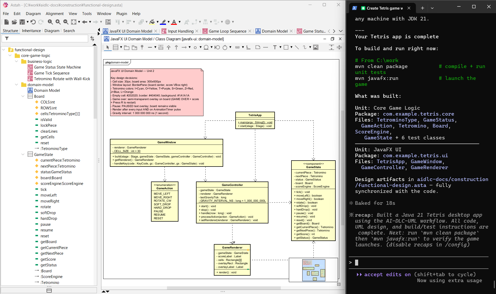
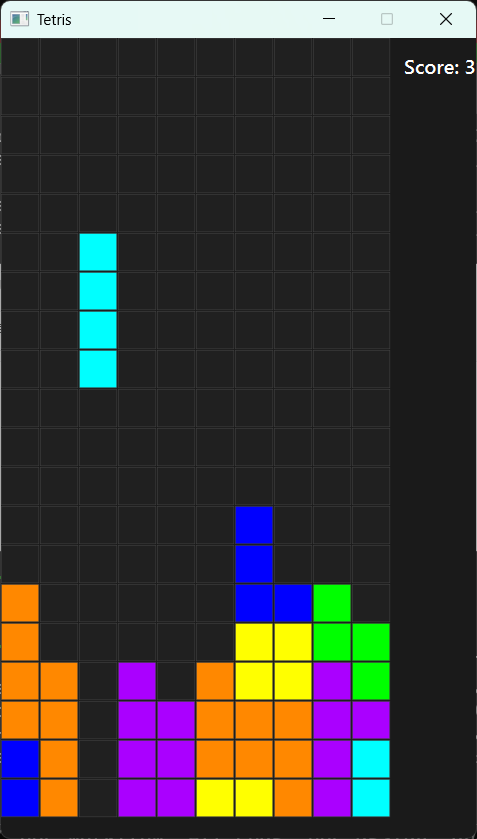

# AI-DLC-UML (AI-Driven Development Life Cycle with UML Modeling)

AI-DLC-UML modifies [AI-DLC](https://github.com/awslabs/aidlc-workflows) to enable AI agents to drive the software development workflow with UML modeling. It is intended for those who want to use UML modeling collaboratively in their design practices, even in AI-driven software development.

Key modifications to AI-DLC include:
- Application-design and functional-design artifacts are created as UML models.[^1]
- A step has been added to maintain consistency between the design artifacts and the codebase.
- Supported AI agents are limited to Claude Code, Codex CLI, and Gemini CLI.[^2]

[^1]: Other artifacts, such as non-functional requirements and technology stack definitions, are created as Markdown files, as in the original AI-DLC.

[^2]: Based on our personal experience, as of May 2026, AI agents other than these are not yet able to reliably distinguish among and use the more than 300 Astah Pro MCP tools.

The orange-highlighted steps in the flowchart below show modifications to the original AI-DLC.

```mermaid
flowchart TD
    A((Start)) --> B

    subgraph B["Inception phase"]
        direction TB
        B1["Workspace Detection<br/>(Always)"]
        B2["Reverse Engineering<br/>(Conditional)"]
        B3["Requirements Analysis<br/>(Always)"]
        B4["User Stories<br/>(Conditional)"]
        B5["Workflow Planning<br/>(Always)"]
        B6["Application Design *1<br/>(Conditional)"]
        B7["Units Generation<br/>(Conditional)"]

        B1 --> B2 --> B3 --> B4 --> B5 --> B6 --> B7
    end

    B --> C

    subgraph C["Construction phase"]
        direction TB
        C1[/"Loop Start<br/>(for each unit)"\]
        C2["Functional Design *1<br/>(Conditional)"]
        C3["NFR Requirements Assess<br/>(Conditional)"]
        C4["NFR Design<br/>(Conditional)"]
        C5["Infrastructure Design<br/>(Conditional)"]
        C6["Code Generation<br/>(Always)"]
        C7["Design-Code Sync *2<br/>(Conditional)"]
        C8[\"Loop End"/]
        C9["Build and Test<br/>(Always)"]

        C1 --> C2 --> C3 --> C4 --> C5 --> C6 --> C7 --> C8 --> C9
    end

    C --> D

    subgraph D["Operations phase"]
        direction TB
        D1["Operations<br/>(Placeholder)"]
    end

    D --> E((End))

    style B6 fill:#ffcc99,color:#000
    style C2 fill:#ffcc99,color:#000
    style C7 fill:#ffcc99,color:#000
```

<details>
<summary>AI-DLC-UML workflow overview:</summary>



*1 [Modified] Create the design artifacts as UML models.  
*2 [Added] Fix inconsistencies between the design artifacts and the codebase.  

</details>

Tailor this workflow as needed to fit your preferred or required workflow. For example, if the target software system will not be mapped to AWS services, some steps could be modified. The Operations phase is included as a placeholder and should be defined according to your workflow.

## Demo

Initial prompt: *Using AI-DLC-UML, create a Java desktop app for Tetris*  
AI agent: Claude Code using Sonnet 4.6  
Processing time: 139 minutes  



<br>

The images below show the created Tetris app and some of the UML diagrams created for it. In this demo, we approved the AI agent's output as-is; only the diagram layout was adjusted manually.

<table>
  <tr>
    <td><a href="demo/tetris-app.png"></a></td>
    <td><a href="demo/application-design/System Architecture.png"></a></td>
    <td><a href="demo/functional-design/javafx-ui/domain-model/JavaFX UI Domain Model.png"></a></td>
    <td><a href="demo/functional-design/core-game-logic/domain-model/Domain Model.png"></a></td>
    <td><a href="demo/functional-design/core-game-logic/business-logic/Game Status State Machine.png"></a></td>
    <td><a href="demo/functional-design/javafx-ui/business-logic/Input Handling.png"></a></td>
  </tr>
</table>

## Requirements

- Claude Code, Codex CLI, or Gemini CLI
  > *Info:* Based on our personal experience, as of May 2026, we recommend Claude Code because its UML modeling capabilities appear more advanced than those of the others. Next, we recommend Codex CLI.

- Astah Pro **v11.0 or later**

- Astah Pro MCP **v0.2.2 or later**

- Node.js **v20 or later**

## Installation

- Install [Claude Code](https://claude.com/product/claude-code), [Codex CLI](https://developers.openai.com/codex/cli), or [Gemini CLI](https://geminicli.com/docs/get-started/installation/)

- Install [Astah Pro](https://astah.net/products/astah-professional/)

- Install the [Astah Pro MCP](https://github.com/takaakit/astah-pro-mcp) plugin

  > *Steps to install:* Launch Astah Pro -> drag and drop the Astah Pro MCP JAR file onto the Astah Pro window -> restart Astah Pro.

- Install [Node.js](https://nodejs.org/)

## Usage

1. It is recommended to disable unused MCP tools to avoid reducing the AI agent's tool-calling accuracy.

2. Open a terminal and go to your project directory

3. Setup AI-DLC-UML in your project directory

   Run this command to place the AI-DLC-UML folders and files in your project directory.

   ```bash
   npx https://github.com/takaakit/ai-dlc-uml.git
   ```

   If the setup fails, manually download this GitHub project and place the following folders and files in your project directory.

   ```
   Your project directory
    ├ .aidlc-rule-details
    ├ .claude
    ├ .codex
    ├ .gemini
    ├ .mcp.json
    ├ AGENTS.md
    ├ CLAUDE.md
    └ GEMINI.md
   ```

   If there are conflicts with existing files, back them up if needed, then replace them.

4. Start Astah Pro

   > *Note:* Launch Astah Pro before starting AI agents, and it should remain open throughout the entire workflow.

5. Start AI agents

   Run the `claude`, `codex`, or `gemini` command in your project directory. A confirmation dialog will pop up on initial connection. Check it and click 'Connect'.

   Recommended AI models:
   - Claude Code: **Sonnet 4.6 or higher**
   - Codex CLI: **GPT-5.5 or higher**
   - Gemini CLI: **Gemini 3.1 Pro or higher**

6. Send a prompt starting with **"Using AI-DLC-UML, ..."**

   Example prompt: *Using AI-DLC-UML, create a Java desktop app for Tetris*

   > *Note:* If you interrupt a workflow—for example, because the rate limit has been reached—and resume it later, connect the AI agent to the Astah Pro MCP server before resuming.

## Additional Info

- AI agents refer to information provided by [OMG](https://www.omg.org/) to understand UML.
- AI agents follow [Agile Modeling](https://agilemodeling.com/) guidelines when creating UML models.

## License

- The original [AI-DLC](https://github.com/awslabs/aidlc-workflows) is licensed under the **MIT-0** license and is copyrighted by Amazon.com, Inc. or its affiliates.
- All modifications and new content added by this project are released under the **CC0 1.0 Universal** (Public Domain) license.

## Contributing

If you have a proposed improvement, please open an issue. Note that **any improvements submitted will be released under the CC0 license**.

## Links

- [AI-DLC](https://github.com/awslabs/aidlc-workflows)
- [Claude Code](https://claude.com/product/claude-code)
- [Codex CLI](TODO)
- [Gemini CLI](TODO)
- [Astah Pro](https://astah.net/products/astah-professional/)
- [Astah Pro MCP](https://github.com/takaakit/astah-pro-mcp)
- [Node.js](https://nodejs.org/)
- [OMG](https://www.omg.org/)
- [Agile Modeling](https://agilemodeling.com/)
